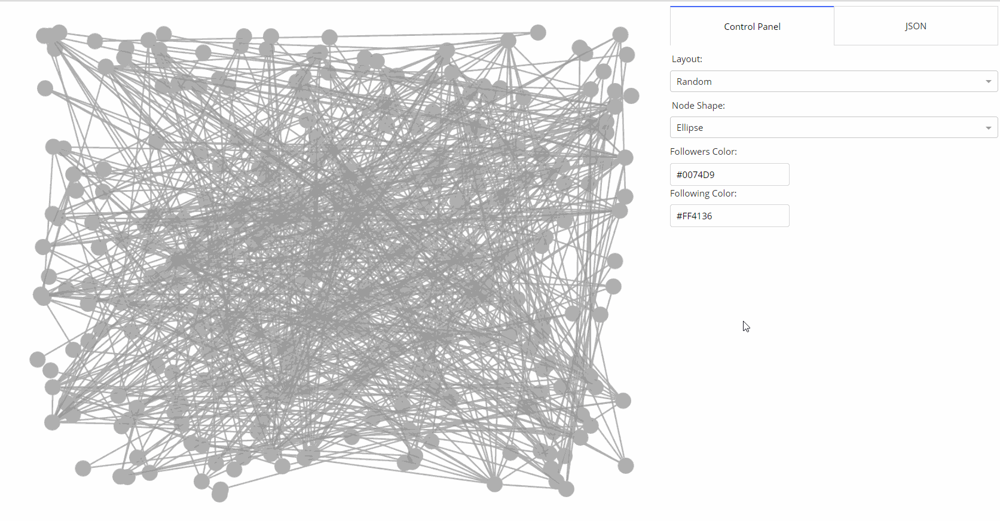
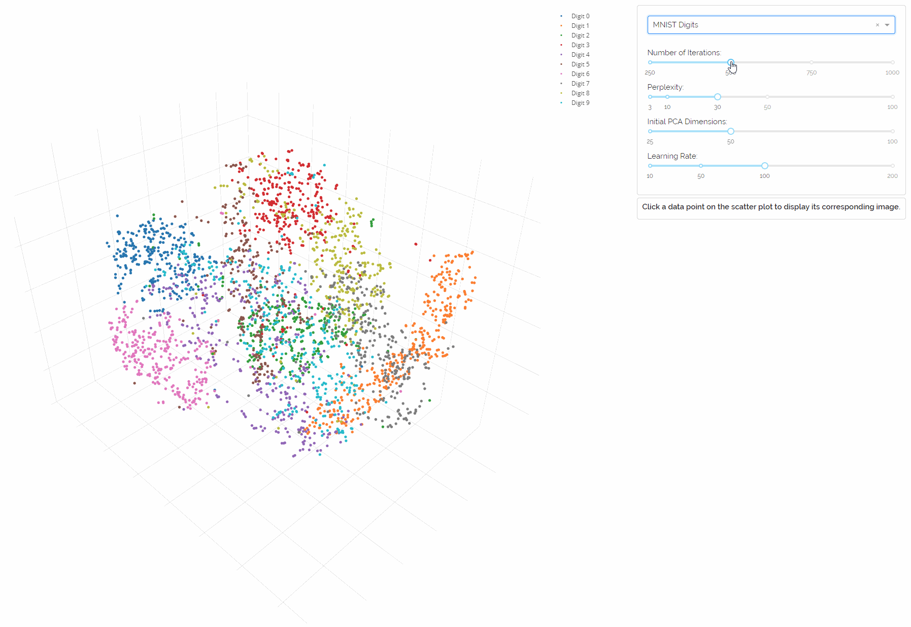
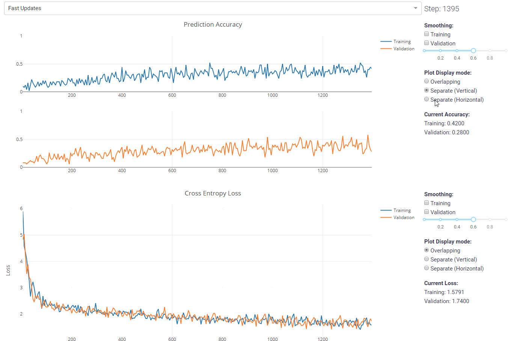

## Dash Cytoscape
[Link to Repo](https://github.com/plotly/dash-cytoscape) | [Documentation](https://dash.plot.ly/cytoscape) | [PyPi Installation](https://pypi.org/project/dash-cytoscape/)

Dash Cytoscape is a graph visualization component for creating easily customizable, high-performance, interactive, and web-based networks. It extends and renders Cytoscape.js, and offers deep integration with Dash layouts and callbacks, enabling the creation of powerful networks in conjunction with the rich collection of Dash components, as well as established computational biology and network science libraries such as Biopython and networkX.

## SVM Explorer
[Link to Repo](https://github.com/plotly/dash-svm) | [Demo App](http://dash-svm.herokuapp.com/)

This app lets you explore support vector clustering (a type of support vector machine) with UI input parameters. Toy datasets and useful ML metrics plots are included. It is fully written in Dash + scikit-learn.

## t-SNE Explorer
[Link to Repo](https://github.com/plotly/dash-tsne) | [Demo App](https://dash-tsne.plot.ly/)

t-SNE is a visualization algorithm that projects your high-dimensional data into a 2D or 3D space so that you can explore the spatial distribution of your data. The t-SNE Explorer lets you interactively explore iconic image datasets such as MNIST, and state-of-the-art word embeddings such as GloVe, with all the computation done ahead of time. Data point previews and graphs help you better understand the dataset.

## Live Model Training Viewer
[Link to Repo](https://github.com/plotly/dash-live-model-training) | [Demo App](https://dash-live-model-training.plot.ly/) 

Tracking accuracy and loss is an essential part of the training process for deep learning models. This real-time visualization app monitors core metrics of your Tensorflow graphs during the training so that you can quickly detect anomalies within your model.

## Object Detection App
[Link to Repo](https://github.com/plotly/dash-object-detection) | [Demo App](https://dash-object-detection.plot.ly/)

This object-detection app provides useful visualizations about what's happening inside a complex video in real time. The data is generated using MobileNet v1 in Tensorflow, trained on the COCO dataset.

## Image Processing App
[Link to Repo](https://github.com/plotly/dash-image-processing) | [Demo App](http://dash-image-processing.herokuapp.com/)

This app wraps Pillow, a powerful image processing library in Python, and abstracts all the operations through an easy-to-use GUI. All the computation is done on the back-end through Dash, and image transfer is optimized through session-based Redis caching and S3 storage.

---

Back to [homepage](https://xinghanlu.com/).
